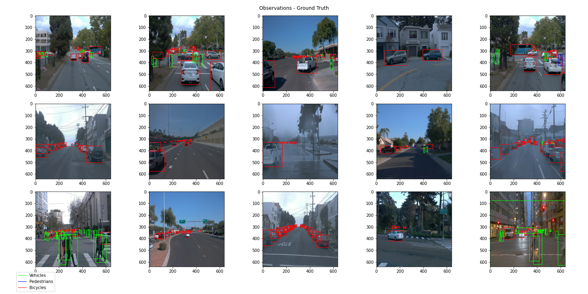
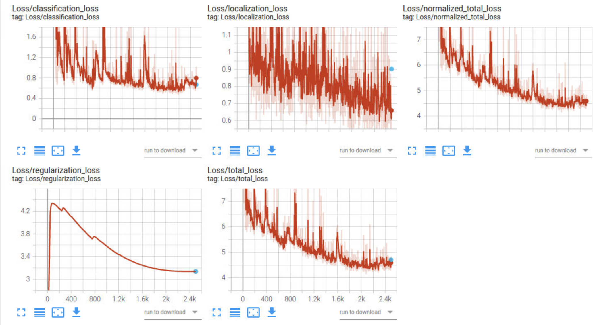
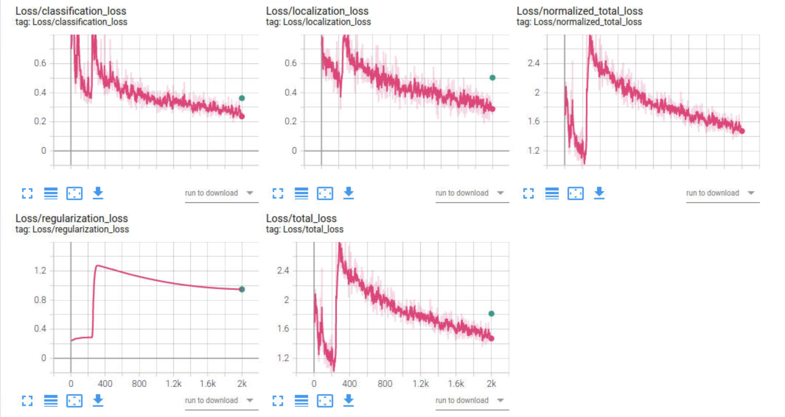

# Project Writeup - Object Detection in an Urban Environment

## Project overview
This project handles 2D object detection in an urban environment.
Based on camera images taken by an ego vehicle which should be detected by a pre-trained deep neural-network (DNN).
The main purpose of object detection for self-driving cars is to locate and classify objects in the vehicle's surrounding and can be performed using different sensors such as camera and lidar. Achieving object detection allows safe maneuvers to be planned and executed.
### Steps
In the first step some exploratory data analysis (EDA) is performed. The overall appearance of images  (light conditions, blurs, distortions etc.) is assessed and the occurence and distribution of objects across these images was analyzed in order to decide on necessary augmentations and parameters for our algorithm.

In the second step, the pretrained SSD Resnet 50 640x640 model was downloaded from [tensorflow.org](http://download.tensorflow.org/models/object_detection/tf2/20200711/ssd_resnet50_v1_fpn_640x640_coco17_tpu-8.tar.gz) and the respective pipeline set up for training and validation using the config file.

After a reference run on the training and validation datasets, that model should then be improved using e.g.:
* image augmentations, as available in the [preprocessor.proto file](https://github.com/tensorflow/models/blob/master/research/object_detection/protos/preprocessor.proto)
* parameter tuning / optimizer improvements: type of optimizer, learning rate, scheduler etc.
* architecture changes (incl. a new pipeline config) using the Tf Object Detection API [model zoo](https://github.com/tensorflow/models/blob/master/research/object_detection/g3doc/tf2_detection_zoo.md).
### Set up
The project was completed in the workspace provided by Udacity.
For information on the local setup and general approach, please refer to the README in the 
Github Starter Code Repository provided [here](https://github.com/udacity/nd013-c1-vision-starter).
## Data
### Exploratory Dataset Analysis (EDA)
The implementation and original images for the exploratory analysis of our dataset can be found 
in the ([Exploratory Data Analysis.ipynb](https://github.com/hazemfahmyy/Object-Detection-in-an-Urban-Environment/blob/main/Exploratory%20Data%20Analysis.ipynb)) notebook.
The EDA shows that the dataset is imbalanced. 
Light conditions vary heavily across the dataset, with sunny conditions (leading to bright images with high contrast)
as well as rainy/foggy conditions (causing reflections and blurs in the images) alike. 
Also, there are recordings of night drives.
Image distortions can be observed as well, especially on the image edges.

The pie char below displays the percentage of classes across all images, and it can be seen that there are much more vehicles (~78%) than pedestrians (~21%) and bicycles (~1%).
Our model is likely to overfit on vehicles, while performing less optimal on bicycles.

### Cross-validation
The creation of training and validation split was already done in the workspace, with 87 images and 10 images in the training and validation set.
## Training & Evaluation
### Reference experiment
The reference run with the pretrained model had very suboptimal results.
The final overall loss is ~4.5 (orange plot) for the training set and ~4.7 (blue dot) for the test set.

### Improvement on the reference - experiment0
based on the results of the EDA, different augmentations are used, e.g.
* `random_adjust_brightness` to increase the diversity in brightness across the given images
* `random_adjust_hue`, `random_rgb_to_gray` to mimic different light conditions (e.g. a blueish or yellowish tint caused by artificial lights)
* `random_black_patches` to mimic occlusions (i.e. caused by other objects)
* the default agumentations are also kept in the config file (experiments/experiment0/pipeline_new.config) (horizontal flip and image crop)

```
  data_augmentation_options {
    random_horizontal_flip {
    }
    random_adjust_hue{
    max_delta:0.8
    }
    random_rgb_to_gray{
    probability:0.5
    }
    random_adjust_brightness{
    max_delta:0.8
    }
    random_black_patches{
    }
    random_jitter_boxes{
    ratio:0.4
    }
    random_crop_image {
      min_object_covered: 0.0
      min_aspect_ratio: 0.75
      max_aspect_ratio: 3.0
      min_area: 0.75
      max_area: 1.0
      overlap_thresh: 0.0
    }
  }
```
The augmentation exploration can be found in the ([Explore augmentations](Explore+augmentations.ipynb)](https://github.com/hazemfahmyy/Object-Detection-in-an-Urban-Environment/blob/main/Explore%20augmentations.ipynb)) notebook.
In the `experiment0` run, I also increased the batch size from 2 to 6 and decreased number of epochs from 2500 to 2000 (to keep the same running time of 1~2hours).
As a conclusion the model seems to have improved in training: 
The final overall loss could be reduced to around ~1.5 (pink plot) for the training set and ~1.8 (green dot) for the test set.
Also as seen from the image below, Early-Stopping could come handful in such a case to stop learning at epoch number 300 where the training had its global minimum at ~0.9 and increased to ~2.6, where it kept iterating to reach a final loss of ~1.5.
The training and validation results of the improved pipeline are displayed below:

As can be seen in the animation below, the detection of vehicles is - despite the improvements in metrics - still insufficient where some vehicles were not detected at the begining of the scene:


As a further improvement that comes at the cost of using more GPU time, some parameters could be played with as the learning rate and batch size in addition to different augmentations (e.g., rotation and translation) in order to generate different models and selecting the best results.
