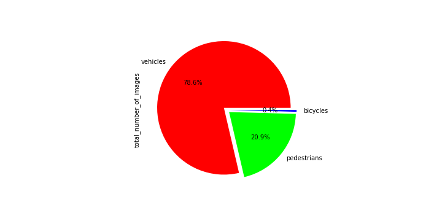

# Project Writeup - Object Detection in an Urban Environment

## Project overview
This project is concerned with 2D object detection in an urban environment.
Based on camera images taken by an ego vehicle which should be detected by a pre-trained deep learning algorithm.
The main purpose of object detection for self-driving cars is to locate and classify objects in the vehicle's surrounding and can be performed using different sensors (e.g. camera, lidar). This is an important task for the operation of a self-driving car to run safely, allowing it to visualize other surroundings in its environment. Achieving object detection allows safe maneuvers to be planned and executed.
### Steps
As a first step, some exploratory data analysis (EDA) is performed. The overall appearance of images  (light conditions, blurs, distortions etc.) was assessed and the occurence and distribution of objects across these images was analyzed in order to decide on necessary augmentations and parameters for our algorithm.

In the second step, the pretrained SSD Resnet 50 640x640 model was downloaded from [tensorflow.org](http://download.tensorflow.org/models/object_detection/tf2/20200711/ssd_resnet50_v1_fpn_640x640_coco17_tpu-8.tar.gz) and the respective pipeline set up for training and validation using the config file.

After a reference run on the training and validation datasets, that model should then be improved using e.g.:
* image augmentations, as available in the [preprocessor.proto file](https://github.com/tensorflow/models/blob/master/research/object_detection/protos/preprocessor.proto)
* parameter tuning / optimizer improvements: type of optimizer, learning rate, scheduler etc.
* architecture changes (incl. a new pipeline config) using the Tf Object Detection API [model zoo](https://github.com/tensorflow/models/blob/master/research/object_detection/g3doc/tf2_detection_zoo.md).
### Set up
The project was completed in the workspace provided by Udacity.
For information on the local setup and general approach, please refer to the README in the 
Github Starter Code Repository provided [here](https://github.com/udacity/nd013-c1-vision-starter).
## Data
### Dataset Analysis
The implementation and original images for the exploratory analysis of our dataset can be found 
in the [Exploratory Data Analysis](Exploratory+Data+Analysis.ipynb) notebook.
It is obvious that the dataset is highly imbalanced. 
Light conditions vary heavily across the dataset, with sunny conditions (leading to bright images with high contrast)
as well as rainy/foggy conditions (causing reflections and blurs in the images) alike. 
Also, there are recordings of night drives.
Image distortions can be observed as well, especially on the image edges.

The mentioned imbalances in the dataset are visualized below, based on 1000 images from the training dataset.
The diagram displays the percentage of objects per object type across all sampled images, and it can be seen that there are roughly 125x more vehicles than bicycles, which make up for only ~0.6% of all objects.
Our model is likely to overfit on vehicles, while performing less optimal on bicycles.

### Cross-validation
The creation of training vs. validation split, which is usually performed based on the EDA, was already done in the workspace, with 87 images and 10 images in the training and validation set.
## Training & Evaluation
### Reference experiment
As expected, the reference run with the pretrained model did not yield optimal results.
The losses decrease with the number of epochs, 
but e.g. the classification loss seems to reach a base plateau rather fast.
The final overall loss is ~4.5 for the training set and ~4.7 for the test set.

### Improvement on the reference - experiment0
based on the results of the exploratory data analysis, I started off using some image augmentations, e.g.
* `random_adjust_brightness` to increase the diversity in brightness across the given images
* `random_adjust_hue`, `random_rgb_to_gray` to mimic different light conditions (e.g. a blueish or yellowish tint caused by artificial lights)
* `random_black_patches` to mimic occlusions (i.e. caused by other objects)
* I kept the already implemented augmentations (horizontal flip and image crop)

```
  data_augmentation_options {
    random_horizontal_flip {
    }
    random_adjust_hue{
    max_delta:0.8
    }
    random_rgb_to_gray{
    probability:0.5
    }
    random_adjust_brightness{
    max_delta:0.8
    }
    random_black_patches{
    }
    random_jitter_boxes{
    ratio:0.4
    }
    random_crop_image {
      min_object_covered: 0.0
      min_aspect_ratio: 0.75
      max_aspect_ratio: 3.0
      min_area: 0.75
      max_area: 1.0
      overlap_thresh: 0.0
    }
  }
```
The augmentation exploration can be found in the [Explore augmentations](Explore+augmentations.ipynb) notebook.
In the `experiment0` run, I also increased the batch size from 2 to 6 and increased number of epochs to 2000 (to keep the same running time of 1~2hours)
As a conclusion the model seems to have improved a lot in training: 
The final overall loss could be reduced to around ~1.5 for the training set and ~1.8 for the test set.
The training and validation results of the improved pipeline are displayed below:

As can be seen in the animation, the detection of vehicles is - despite the improvements in metrics - still insufficient.
The performance of the model is shown in the video below:

### Outlook
The experiments demonstrate how augmentations and model parametrization can be used to improve the performance of our object detection model.
Further improvements could be made and other tactics employed e.g. for dealing specifically with the minority class,
in order to reliably detect _all_ traffic participants or for improving the performance on small objects.
Since augmenting images on a very small set of samples has its limits, 
an important step here could be to specifically collect more image data on the minority class, bicycles.
